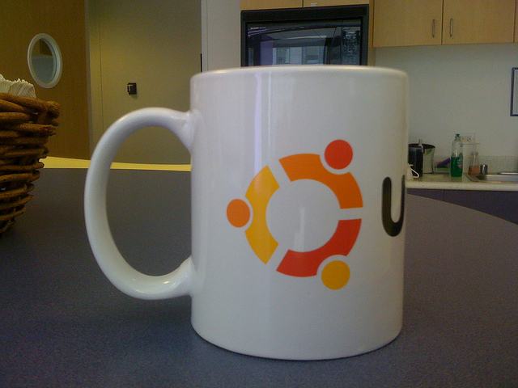

# Fooling Convolutional Neural Networks

This jupyter notebook explores various techniques that can be used to fool image classifiers. We use the VGG-16 network, which will predict what an object in an image is from 1000 possible classes.
The aim of this work is to modify an image of a coffee mug, such that to a human it is still recognisable, but the network will mis-classify the image.

This piece of work was produced for a class assignment.

## Techniques

These are the different approaches we explore to get the netowrk to mis-classify:

* Multiple blurring techniques
* Warping
* Changing brightness
* Modifying colour
* Removing distinctive features
* Changing backgrounds and environments
* Different picture angles
* Drawings

These are two recently published pieces of research we examine which can fool a convolutional neural network:

* [Jiawei Su, Danilo Vasconcellos Vargas, Sakurai Kouichi, One pixel attack](https://arxiv.org/abs/1710.08864)
* [Tom B. Brown, Dandelion Mané, Aurko Roy, Martín Abadi, Justin Gilmer, Adversarial Patch](https://arxiv.org/abs/1712.09665)

## Example


Here is an image of a normal mug. We can feed this image to the network to see what it thinks the object is. A percentage of the confidence in its guess is also printed.

```
> predict(normal_mug)
coffee_mug (75.27%)
```
So the network is 75.27% sure that this image is a coffee mug.
Now we distort the image using some technique, say blurring with gaussian filtering. Here is the result.


Ok, that kind of still looks like a cofee mug! Now we can feed the distorted image to the same network and see what it thinks it is.

```
> predict(distorted_mug)
pill_bottle (12.36%) 
```
Now the classifier is 12.36% sure it is a pill bottle! This demonstrates the effect of blurring an image on its classification result for this popular neural network. Blurring images like this might be effective because we are distorting the low level features (such as small lines) that the classifier depends on to make its prediction.
